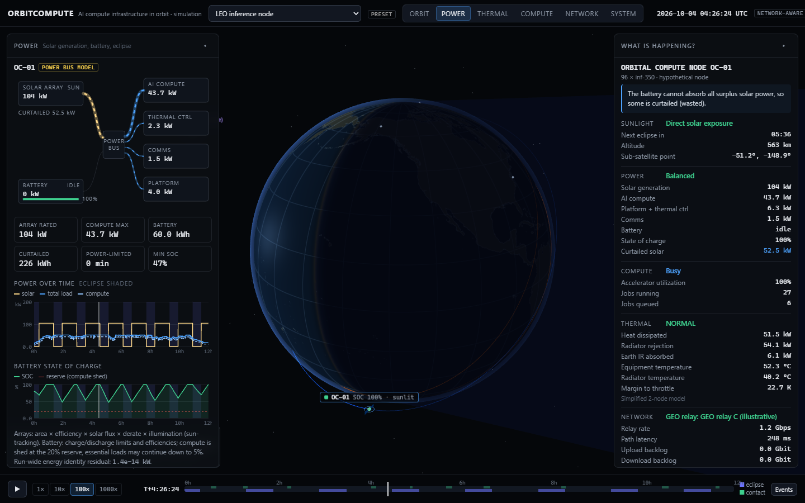
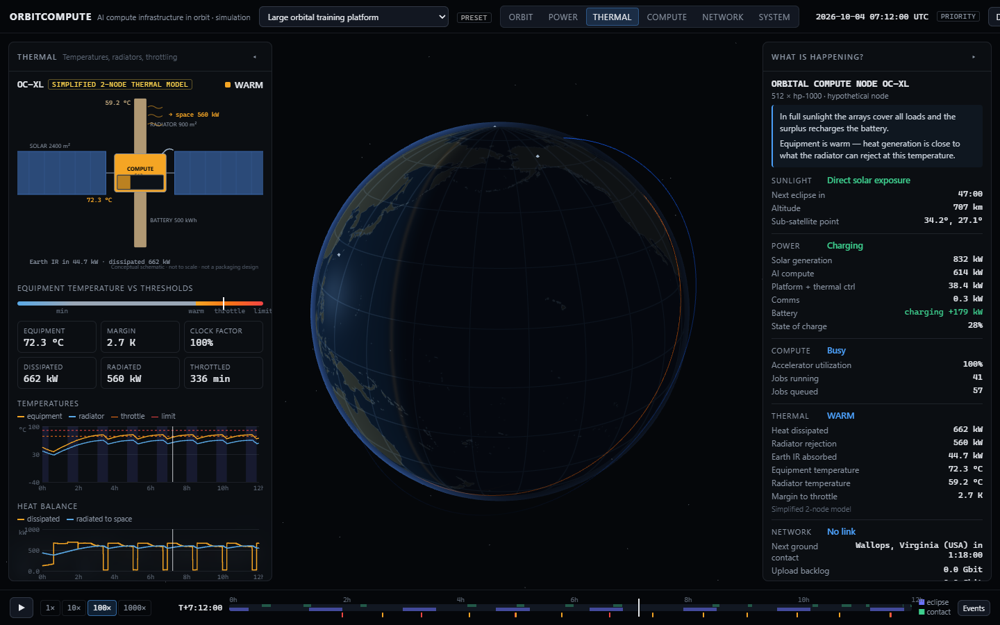
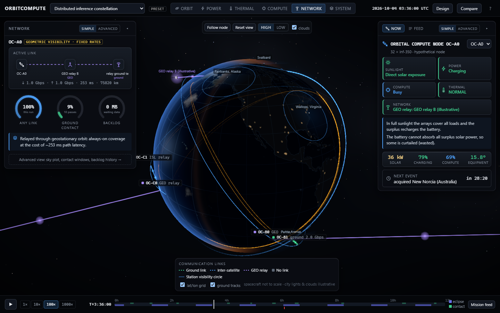
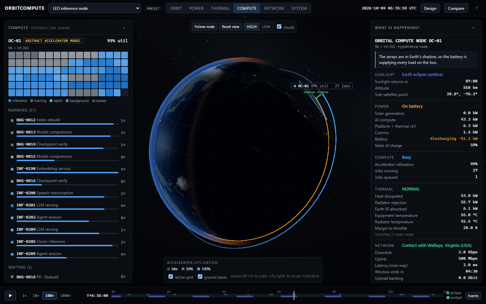
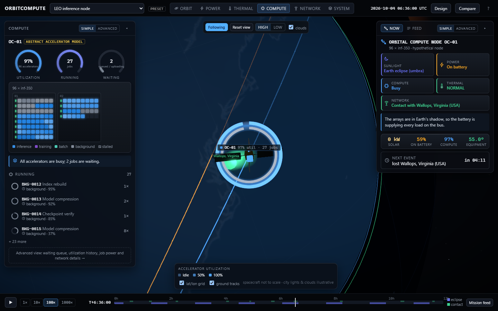
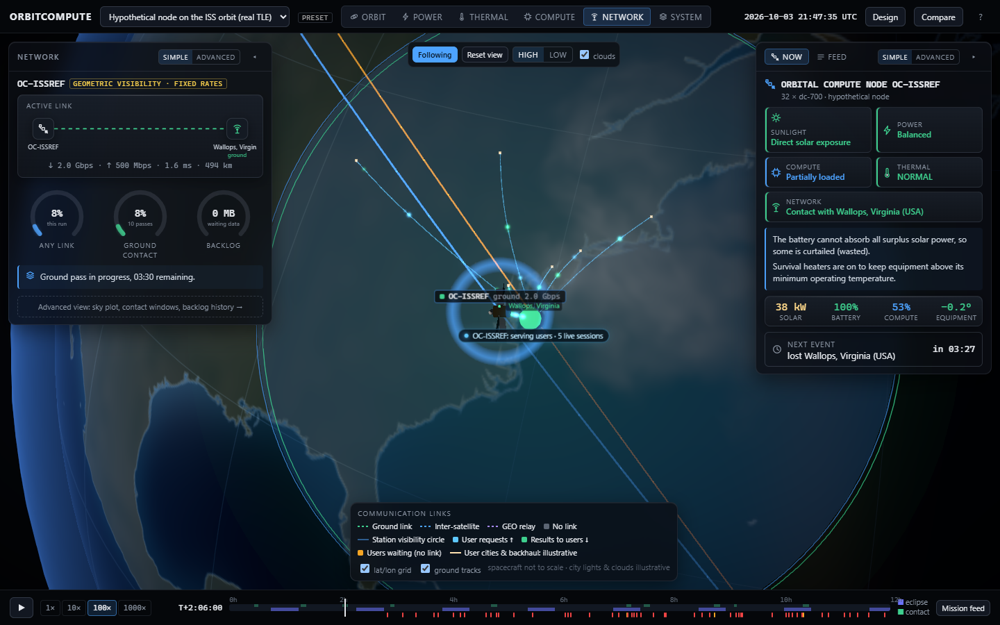

# OrbitCompute — AI Data Centers in Orbit

An interactive engineering simulation exploring one question:

> *What would it actually take to operate large-scale AI compute infrastructure in orbit?*

Build a hypothetical orbital compute node or constellation, then watch it operate around Earth:
orbital motion, sunlight and eclipse, solar power and batteries, AI workloads and schedulers,
radiator heat rejection and throttling, and ground-station / relay communication windows — all
replayed from a deterministic physics-based engine.

**Not** a satellite tracker, not flight software, not a spacecraft design tool. See
[`docs/SCIENCE.md`](docs/SCIENCE.md) for exactly what is and isn't modelled.



| Thermal (megawatt training platform throttling) | Network (6-node constellation, ISL + GEO relay) |
|---|---|
|  |  |
| **Compute** (racks, jobs) | **Follow-cam close-up** |
|  |  |

**People on Earth:** requests (cyan) flow from nearby cities through Wallops up to the spacecraft; results (green) flow back down.



## Quick start
```bash
# backend (Python 3.11+, uv)
cd backend && uv sync && uv run uvicorn orbitcompute.api:app --port 8000
# frontend (Node 20+)
cd frontend && npm install && npm run dev
# open http://localhost:3000
```

## What you can do
- **Watch a living system**: play at 1×–1000×, scrub anywhere (scrubbing backward restores the exact
  state), click any feed entry to jump to it.
- **Six visualization modes** on one 3D scene — Orbit, Power, Thermal, Compute, Network, System —
  each with a detail panel in **Simple** (one hero visual, key gauges, a one-line insight) or
  **Advanced** view (every chart, table and model note): Sankey power flow, isometric thermal
  schematic, accelerator racks with a job lifecycle inspector, link path + polar sky plot + contact
  windows, live ground-track map, and a node health matrix.
- **Cinematic scene** (High quality): bloom, procedural spacecraft with sun-tracking wings and
  false-colour radiators, time-faded orbit trails, visibility cones, link beams with data packets,
  Earth-shadow volume, follow-cam (double-click a spacecraft). Low quality for modest GPUs.
- **Now** — a deterministic explanation of the selected node at every instant, including *why*
  (e.g. "In Earth's shadow the battery alone cannot cover the requested compute load, so compute is
  shed to protect the reserve").
- **People on Earth** — data packets travel from nearby cities to the ground station (or GEO-relay
  terminal / ISL neighbour) and up to the spacecraft as requests (cyan), and back down as results
  (green). With no link, requests pile up at the station in amber and the label shows how many
  sessions are waiting and when the next contact comes. Packet density follows the simulated
  link use and realtime sessions; city locations and terrestrial backhaul are illustrative.
- **Mission feed** — one chronological, plain-language feed of everything that happens across all
  spacecraft (eclipses, power shortages, overheating, link changes, summarised job completions,
  deadline misses), each with what it means, a "Coming up" preview, and click-to-jump.
- **Design** orbit (presets, altitude, inclination, RAAN, eccentricity, sun-synchronous LTAN, live
  preview), hardware (compute, arrays, battery, radiator, comms), workloads (seeded generator or
  JSON import), ground stations, scheduler; up to 12 nodes.
- **Compare** two scenarios or two schedulers with metric deltas and synchronized timelines.
- **Eight presets** including a node on the real ISS orbit (CelesTrak TLE, SGP4), a dawn–dusk
  sun-synchronous batch node, a power-constrained trainer, a megawatt training platform with a
  marginal radiator, and monolithic vs. distributed architectures.

## Things the model shows (with stated simplifications)
- A 53° LEO node spends ~37% of each orbit in eclipse; a dawn–dusk SSO in October sees none.
- Realtime inference is gated by connectivity: ~9% ground-contact availability for one 53° node with
  eight stations, ~100% with three (illustrative) GEO relays.
- Radiators dominate at scale: rejecting ~600 kW near 60 °C needs on the order of 1000 m² of
  radiating area; undersize it and compute throttles for hours.
- Energy-aware scheduling trades completed jobs for zero power shortages and a protected battery
  reserve; thermal-aware scheduling trades throughput for zero throttling.

## Layout
- `backend/` — FastAPI + NumPy simulation engine, SQLite persistence, pytest suite
- `frontend/` — Next.js + React Three Fiber visualization, Vitest + Playwright
- `docs/` — architecture, scientific model, validation rules, data sources, roadmap
- `.claude/skills/` — project-specific skills for AI-assisted development

## Tests
```bash
cd backend && uv run pytest -q                       # 73 numerical + API tests
cd frontend && npm run typecheck && npm run lint && npm run test
cd frontend && npm run e2e                           # Playwright, uses installed Microsoft Edge
```

## Data & honesty
Every value is labelled REAL, PHYSICS, MODEL, USER or PRESET. Presets are illustrative examples, not
spacecraft proposals; accelerator presets are generic classes, not products. Ground-station
coordinates are approximate public site locations with illustrative link parameters. See
[`docs/DATA_SOURCES.md`](docs/DATA_SOURCES.md).
